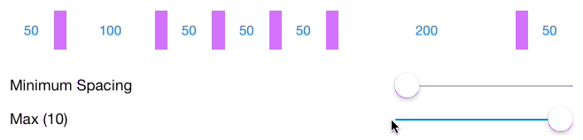

SEUICollectionViewLayout
========================
SEUICollectionViewLayout is an enhanced base class for writing custom UICollectionViewLayout subclasses.  It uses its own mechanism for registering views and animating supplementary and decoration views so you only have to write `prepareLayout` and `layoutAttributesForElementsInRect:`.

Survey Demo
-----------

This demo is written in Swift and shows how you can insert and delete views from a layout just by telling it to skip drawing rather than manipulating the model.

Survey items are defined with visiblity dependencies:

```json
{
  "id": "lang-ios-swift",
  "show-if": "lang-ios=true"
}
```

When a value is changed KVO updates the `hidden` field which triggers a layout invalidation:

```swift
survey.hidingChangedCallback = {
  [unowned self] in
  self.collectionView.performBatchUpdates({ () -> Void in
    layout.invalidateLayout()
  }, completion: nil)
}
```

When `performLayout()` is called it calls `collectionView:layout:shouldHideItemAtIndexPath:` and applies the hidden style.


Toolbar Demo
------------

This demo is written in Objective-C and shows an approach to handling overflow from inside the layout.  It provides a toolbar that can hold any number of items.  In some cases (landscape phone, iPad, iPhone 6) all the items will fit but on smaller phones they might not.  In the latter case it displays a "More" button so the rest of the items can be placed in an action sheet.

This layout has two properties, minimum item spacing and the maximum number of items to show if not everything fits.  The second property lets you show only the most important items in the compressed mode.

`prepareLayout` first tries to see if everything will fit.  If not it takes items up to the maximum and sees how many will fit if the "More" button is visible.  It then takes the set of visible layout attributes and arranges them on the screen.  It also provides a readonly property `numberOfVisibleItems` for use by the More option.



**Toolbar in Stack Exchange.app**


Installation
------------

```ruby
pod 'SEUICollectionViewLayout'
```
